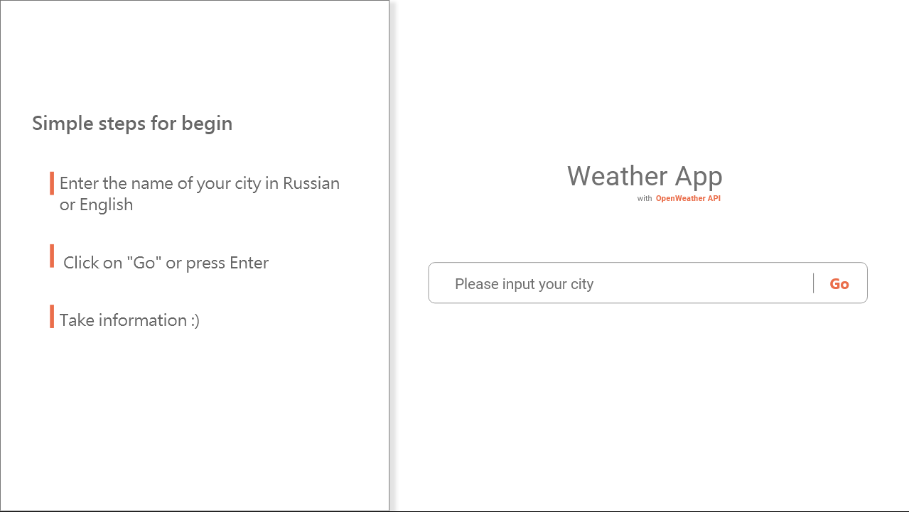

# Weather-App

See a work here: https://tripplicate.github.io/Weather-App/

### Description

The simple app for display weather in your city. It uses free OpenWeather API.
The source code can be viewed in the src folder. the application is still raw and will be improved at the moment

Version: 0.1.2

### Screenshot

### Author

(C) 2020 Sergeev Danil | telegram: @triplicatesouls
